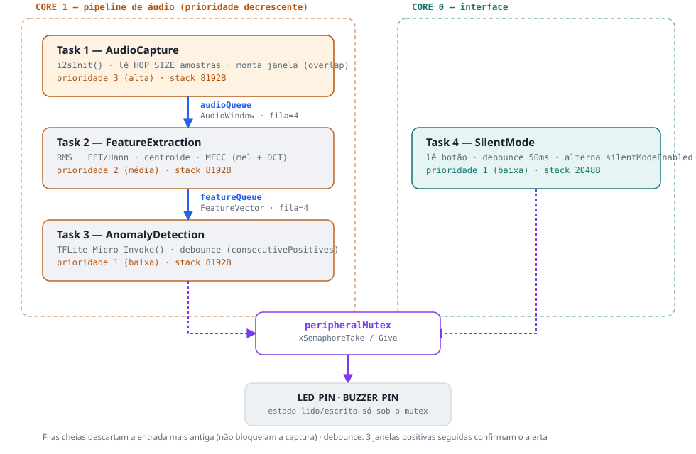

## Visão geral

O firmware roda sobre **FreeRTOS** distribuído em
**4 tasks** e **2 núcleos** do ESP32. O pipeline de detecção (captura → features → inferência) roda inteiro no Core 1, encadeado por duas filas; a interface de modo silencioso roda isolada no Core 0.



## As 4 tasks

| Task | Core | Prioridade | Stack | Responsabilidade |
|---|---|---|---|---|
| `AudioCapture` | 1 | 3 (alta) | 8192 B | Lê o INMP441 via I2S, normaliza amostras de 24 bits e monta janelas de 1024 amostras com overlap (hop de 512) |
| `FeatureExtraction` | 1 | 2 (média) | 8192 B | Calcula RMS, centroide espectral (FFT + Hann) e 10 coeficientes MFCC (mel filterbank + DCT) |
| `AnomalyDetection` | 1 | 1 (baixa) | 8192 B | Roda a inferência TFLite Micro (`Invoke()`) e aplica o debounce de confirmação |
| `SilentMode` | 0 | 1 (baixa) | 2048 B | Lê o botão de modo silencioso com debounce de 50ms |

### Por que essa ordem de prioridades

As prioridades **decrescem ao longo do pipeline** (captura > features > detecção) de propósito: se
alguma etapa a jusante atrasar (por exemplo, a inferência do modelo demorar mais que o esperado), o
FreeRTOS garante que a **captura de áudio nunca é interrompida**, perder uma amostragem de áudio
corrompe a janela inteira, enquanto perder uma janela de features ou uma inferência apenas descarta
um resultado.

### Por que `SilentMode` está isolado no Core 0

O botão de modo silencioso não tem nenhuma relação de tempo real com o áudio, assim, colocá-lo em um núcleo separado garante que ele nunca dispute CPU com o pipeline de detecção, mesmo que alguém
segure o botão ou gere um bounce elétrico ruidoso.

## Sincronização: filas e mutex

### Filas (`audioQueue`, `featureQueue`)

As duas filas conectam etapas consecutivas do pipeline, cada uma com profundidade 4. A política de
enchimento é deliberada: **se a fila estiver cheia, a task produtora descarta o item mais antigo em
vez de bloquear**:

```cpp
if (xQueueSend(audioQueue, &window, 0) != pdTRUE) {
    AudioWindow discarded;
    xQueueReceive(audioQueue, &discarded, 0);   // libera espaço
    xQueueSend(audioQueue, &window, 0);
}
```

Isso prioriza **taxa de amostragem constante** sobre **não perder nenhuma janela** — um trade-off
correto para um detector em tempo real, onde uma janela perdida ocasionalmente é aceitável, mas
travar a captura esperando espaço na fila não é.

### Mutex (`peripheralMutex`)

O único ponto de concorrência real do sistema é o acesso ao LED, ao buzzer e à flag
`silentModeEnabled`, compartilhados entre `AnomalyDetection` (que acende o alerta) e `SilentMode`
(que pode silenciá-lo). Ambas as tasks só tocam esse estado sob
`xSemaphoreTake(peripheralMutex, portMAX_DELAY)` / `xSemaphoreGive(peripheralMutex)`, evitando uma
condição de corrida em que o buzzer ligasse entre a leitura e a escrita da flag de modo silencioso.

### Debounce de detecção

Para evitar alarmes disparados por um único falso positivo pontual, a confirmação de alerta exige
`CONFIRM_WINDOWS_COUNT` (3) janelas consecutivas classificadas como positivas antes de acionar o
alerta "confirmado" — uma primeira janela positiva já aciona um estado "suspeito" (LED piscando),
dando uma indicação visual antes da confirmação total.

## Instrumentação de latência

Cada estágio do pipeline é marcado com `esp_timer_get_time()` (resolução em microssegundos), com o
timestamp de captura propagado pelas próprias structs que trafegam nas filas (`AudioWindow`,
`FeatureVector`), permitindo medir tanto a latência por estágio quanto a latência fim-a-fim sem
qualquer sincronização de relógio externa:

| Métrica | O que mede |
|---|---|
| `lat_captura_features` | Tempo entre a janela de áudio ficar pronta e as features terminarem |
| `lat_features_deteccao` | Tempo entre as features prontas e o início do preparo do tensor de entrada |
| `lat_inferencia` | Tempo apenas do `interpreter->Invoke()` (TFLite Micro) |
| `lat_fim_a_fim` | Da captura até a decisão — a métrica mais relevante para "detecção em tempo real" |

A cada 50 janelas processadas, o firmware também imprime um resumo agregado (mínimo, média e
máximo) de latência fim-a-fim e de inferência pura.

:::tip Resultados medidos
Com o [teste automatizado](./teste-automatizado.md#latência-medida) rodando sobre 10.562 janelas de
áudio reais, a latência fim-a-fim medida foi de **4.93 ms em média**, com variação praticamente nula
entre clipes (4.930–4.932 ms) — um tempo de processamento determinístico, como esperado de um
pipeline cujo custo por janela (tamanho de FFT, número de filtros mel, tamanho do tensor) não
depende do conteúdo do áudio.

Como cada janela nova é produzida a cada 32 ms (`HOP_SIZE/SAMPLE_RATE` = 512/16000 s), a latência
medida consome apenas ~15% desse orçamento — folga confortável que evita o acúmulo de atraso nas
filas e confirma o funcionamento em tempo real do pipeline completo (captura → features →
inferência → decisão).

O detalhamento por estágio (`lat_captura_features`, `lat_features_deteccao`, `lat_inferencia`)
está disponível linha a linha no log serial do firmware, com um resumo agregado impresso a cada 50
janelas.
:::

## Estudo de caso: stack overflow silencioso

### Sintoma

Ao habilitar a `AudioCapture` task, o ESP32 entrava em um loop de reset por watchdog
(`TG1WDT_SYS_RESET`) **sem imprimir nenhuma linha de log** — nem mesmo a mensagem de inicialização
do I2S, o que tornava o sintoma parecido com uma falha de hardware ou de configuração do I2S.

### Diagnóstico

A task era criada com uma stack de 4096 bytes, mas suas variáveis locais somavam mais que isso:

```cpp
void audioCaptureTaskFn(void *pvParameters) {
    float hopBuffer[HOP_SIZE];   // 512 floats = 2048 bytes
    ...
    AudioWindow window;          // 1024 floats = 4096 bytes
    ...
}
```

Só essas duas variáveis locais já somavam ~6 KB, mais que a stack inteira de 4 KB alocada para a
task — um estouro de stack que corrompia memória adjacente antes mesmo do primeiro `Serial.println`
executar, o que explica a ausência total de log.

### Correção

```cpp
// Buffers grandes viram `static` (memória estática, não na stack da task)
static float hopBuffer[HOP_SIZE];
static AudioWindow window;
```

e a stack da task foi aumentada de 4096 para 8192 bytes por segurança, em
`xTaskCreatePinnedToCore(...)` no `DetectorSirene.ino`.

### Lição

Em sistemas embarcados com RTOS, **arrays "razoavelmente pequenos" em variáveis locais de uma task
não são inofensivos** — cada task tem sua própria stack, tipicamente pequena (KBs, não MBs como a
stack principal em sistemas com SO completo), e um estouro corrompe memória silenciosamente em vez
de lançar uma exceção clara, manifestando-se como resets aparentemente aleatórios do watchdog. A
técnica de diagnóstico eficaz foi decodificar o backtraço do crash com `addr2line`
(`xtensa-esp32-elf-addr2line`) para confirmar que o ponto de falha estava dentro da alocação de
memória do próprio FreeRTOS/TFLite — um sintoma indireto de corrupção de stack, não um bug de
lógica.
